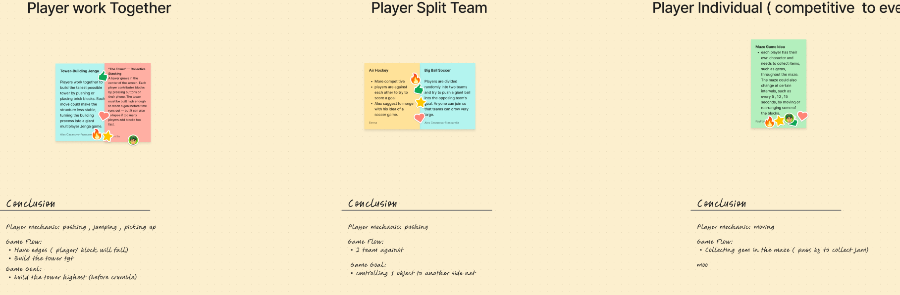

# WEEKLY Journal 

# **WEEK 2**
## Question for Jonathan (Done during class)
google doc link : https://docs.google.com/document/d/1yZWV1TaTlykZLoCNf7EnK5M16_TuUiCcONSc68sI-To/edit?tab=t.0

### Why use a QR code?
- Do we really need to use the Phone?
- What purpose does he need it for in class?
- How do u want to implement this one
- How many people are the min/max for this prototype?
- Asking his Idea/expectation start from ppl scanning the QR code?
Pop- out? 
- Need username/character design first before pop-in (green guy is me)?
- What is the QR code used for?
- What will be the vision for the project (is it mostly physical or digital)
- Do we invite students to work on it? Or use it as an example framework
- How do you want to implement it in CART415
- Will it be software or web-based? (What will be the basis for the phone connections)
- Projectors (software/web-based)
- Phone (software/web base) 

### What will be the expectation (is there any implementation )
- Is it that everyone controls their own character/everyone controls 1 character
- Do you think we should put the instructions on the screen?
- Do we want to do the ppl hand stuff 
- Do we invite students to work on it? Or use it as an example framework
- Do we have an end game / or continue forever?
Timer?
- Do we invite students to work on it? Or use it as an example framework
- Easy understanding / Experience type for the audience? 
- Asking Offline / Online? 

### Resource Link:
https://www.youtube.com/watch?v=482Dh5WfSg0&t=3s

https://www.youtube.com/watch?v=PdGAG5_VKZA

https://oasis.im/

https://www.lablablab.net/

https://www.jonathanlessard.net/

### Inspiration

- Ludodrome: https://www.youtube.com/watch?v=482Dh5WfSg0&t=3s
- slider.io
- Ian Cheng BOB (Bag of Belief): https://www.youtube.com/watch?v=PdGAG5_VKZA
- Kahoot
- Jackbox
- Game Boy link cable
- Scene It/Movie Night: https://www.youtube.com/watch?v=UXHr9OpPjWM&t=1
- Fallout 4/Pit Boy
- https://gamingcouch.com/
- https://www.airconsole.com/

### Expectation 

- seperate controller (phone)
- easy connection 
- implication of using it in 415 
- osc input 
- projection 
- multiple intercation (players)
- fast connection 
- easy interaction and access

### Different Approaches for Connection/Gameplay :
- Scanning QR codes for players to join the game
- Entering a code and all players connecting to a server
- Controller buttons appear on smartphone screens
- Phones used as Wii remotes
- Live leaderboards
- Beginning/End
- Motion Controls X
- Projector
- No phone, body as controller bo
- Big Multiplayer game (More than 4 players can connect)
- Unity game
- Unreal Engine game
- Web game
- Spawn characters 
- Show players' details on phone
- One big game
- A Collection of mini-games
- menu screen or no menu screen 

### Other question to think about 
- will it become with multiple games or just one 
- how are you thinking of contining to build on this.

---

## Updated Journal Notes / Questions or thoughts I had after class

### 1. Client Discovery Questions
These are the most important because Jonathan is the client and ultimately decides what direction the project should take.

- What is the main goal of this project for you in CART 415?
- Do you see this as a class project, a teaching tool, a prototype, or a larger exhibition installation?
- Would you prefer a simple proof-of-concept or a more ambitious multiplayer experience?
- How do you imagine the QR code and phone controls being used in the classroom or exhibition?
- Do you want the project to be more about the social experience, the technology, or the gameplay itself?
- Would you prefer a single game, a set of mini-games, or a flexible system that can grow over time?
- What kind of audience do you imagine playing it: students, casual visitors, class participants, or a wider public audience?
- How much complexity are you comfortable with in a first version?
- Would you like the project to be easy for students to understand quickly, even if it is simpler, or do you want something more technically advanced?
- What would feel like a successful version of this project to you?

### 2. Questions About the QR Code and Phone Controls
- Is the QR code mainly for quick access, for player joining, or for a larger interaction system?
- Do you want players to scan a code and immediately join a game, or do you want a more guided setup process?
- Should the phone act as a simple controller, a role-based tool, or a more expressive input device?
- Do you want players to control one avatar, one action, or a shared group objective?
- Do you prefer buttons, swipes, tilt, motion, or a combination of inputs?
- How many inputs should each player have on their phone before it becomes too confusing?
- Should the phone display only controls, or should it also show game information such as score, role, or active action?
- Would it be better for the on-screen game to be guided by a projector, a wall screen, or a classroom display?

### 3. Multiplayer and Game Structure Questions
- How many players do you imagine in the ideal version of the project?
- Should the project support a few players, a whole class, or a larger crowd of visitors?
- Do you want all players to contribute to one shared event, or do you want them to have separate roles?
- Should the game be collaborative, competitive, or a mix of both?
- Would you prefer a single continuous game, a timed round, or a simpler looping experience?
- Should players join, play for a short moment, and leave, or should they stay for longer sessions?
- Do you want the experience to be more playful and social, or more game-like and competitive?
- Is the goal to have a clear winner, to create a shared spectacle, or to have everyone contribute to a collective result?

### 4. CART 415 / Course Context Questions
- How do you see this project fitting into CART 415 next semester?
- Do you want it to function mainly as a teaching project, a classroom tool, or a final prototype?
- Would you like the project to be simple enough for students to build quickly, or ambitious enough to explore new technical ideas?
- Do you want the class to focus on the game system, the phone interaction, or the overall social installation experience?
- Are you expecting this to be a prototype with a clear scope, or something that could continue evolving over time?
- What would you want students to learn from building this project?

### 5. Questions About Simplicity and Scope
- What is the simplest version of this idea that would still feel exciting?
- Are we aiming for a minimal proof-of-concept, or a richer experience from the start?
- What should be prioritized if we have limited time: the gameplay, the multiplayer system, the visual spectacle, or the technical setup?
- Would you prefer us to reduce the complexity and focus on the core interaction, even if the final version is not too large?
- Do you think it is better to make one strong concept work well rather than trying to include too many features?

### 6. Scenario-Based Questions
These help clarify how the project might work in different contexts.

#### Scenario 1: Quick Crowd Play
- A few people scan the QR code and join immediately
- The game lasts 30–60 seconds
- The effect is visible on the main screen right away
- What do you think of this as a first prototype?

#### Scenario 2: Class Participation
- A whole class joins the project together
- Different players contribute to one shared interaction
- The project is used as a demonstration or workshop tool
- Would this match your vision for CART 415?

#### Scenario 3: Competitive Multiplayer
- Players compete for points or a visible leaderboard
- Each phone acts as a controller for a small action
- The screen shows a clear winner or ranking
- Would you like this kind of competitive structure?

#### Scenario 4: Collective Social Game
- Everyone contributes to one shared result
- The screen shows a collective visual response
- Players do not need a lot of explanation to understand the goal
- Does this feel more aligned with the type of experience you want?

#### Scenario 5: Minimal Technical Prototype
- Only simple movement, buttons, or bright visual responses are connected
- The goal is to prove the networking and phone-to-screen system works
- Would you be comfortable with this as an early stage proof-of-concept?

### 7. Technical / Stack Questions
- Would you prefer a web-based setup, Unity, or another approach for the main project?
- Do you want the focus to be on the idea of multiplayer interaction more than the engine choice?
- Are we mainly trying to prove that a phone can control a shared screen, even if the full game is simple?
- How important is it that the project feels smooth and responsive for a live audience?
- Would a simpler technical stack be more appropriate for a student project in CART 415?

### 8. Visual Thinking Prompt
- Draw the full flow from QR scan -> phone interface -> join screen -> game begins -> projected result on screen
- Sketch 3 different phone control layouts
- Sketch 3 different projected screen setups
- Compare which version feels most understandable and most exciting from a distance

### 9. Questions We Should Ask Jonathan in the Meeting
- Which direction feels most important to you: simple and playable, visually exciting, or technically interesting?
- Do you want the QR code to be a tool for participation, a classroom demonstration, or a social game?
- Is the multiplayer aspect more important than the actual game mechanics?
- Would you prefer we pitch one clear concept or several possible directions?
- What would you want us to show in the next meeting to help you decide?
- If we were to pitch three ideas, which one would you be most interested in seeing?

### 10. Pitch Ideas to Present to Jonathan
These are possible directions we can pitch without committing too early.

#### Pitch Idea 1: Simple Social Multiplayer Game
- Players scan a QR code and join quickly
- Each phone acts as a simple controller
- Everyone contributes to one shared visual result on a big screen
- Best for: quick interaction, low complexity, easy classroom use

#### Pitch Idea 2: Team-Controlled Collective Game
- Players are divided into small teams or roles
- Each phone controls one action or one part of the system
- The screen shows a combined output from everyone
- Best for: collaborative energy and stronger social interaction

#### Pitch Idea 3: Fast Competitive Crowd Game
- Players compete for points, time, or speed
- Phone controls are short and easy to understand
- The screen shows a leaderboard or large combined action
- Best for: excitement and simple visual readability

#### Pitch Idea 4: Minimal Proof-of-Concept
- The project focuses on the connection between phones and a shared screen
- The visual result is simple but clearly interactive
- Best for: testing the system and proving the concept before adding more mechanics

ludodrom exemple: have an icon on the phone and find the other phone 
draw shape 

---

# **WEEK 3**

Notes taken during first meeting with Jonathan: 
https://docs.google.com/document/d/1Mx3We4dOp7mKr-jSiF4E0hrWiADEWIQM-2A8vSljJS4/edit?usp=sharing 

We had a meeting today with our client Jonathan about what we are doing for him. We learned more that we are doing the more test and prototype journey. We do not need to have a working base game at the end, as for him the importance is that all the different approaches to the project and trying to mediate and lessen the amount of risk and problems is what he wants us to do, so that when the 415 class, do not need to lose time on this and can automatically just work on building the game/project.

question to think when thinking about the game :
-  What does the player do with their phone?
- What does their avatar do on the projected screen?
- What are 20–30 players doing at once?
- What happens when someone leaves?
- What happens when someone joins?
- What is the player's goal?
- How does the player know they're succeeding?
- What persists after they leave?
- Is there a reason to keep playing for ~5 minutes?
- What happens if only 1–3 people are there?
- What happens if there are 30 people?
- Can the game exist without a lobby, host, countdown, or coordinated start?

Reference game: 

Babba is You : https://www.youtube.com/watch?v=VjqdPjTKPiU 

SOKOBAN : 
Sokoban minigames and variants generally fall into a few distinctive categories based on how they alter the classic box-pushing, grid-based formula.

- push boxes onto labeled tiles, when all the label tiles have a box on them, do you pass the level.

https://www.youtube.com/watch?v=_iZLe05aJuU 

https://www.youtube.com/watch?v=TgWibgp2NwM 

To build a projected, drop-in/drop-out exhibition game that balances asynchronous multiplayer, persistence, and player interaction, your core technical constraint is the "zero-friction" lifecycle. Because players scan a QR code, play for two minutes, and walk away, the game must never wait for an input, never display a menu, and gracefully clean up abandoned avatars.

1. Concept: 'Eco-System' (The Cooperative Scale Game)
- The Gameplay: The projection displays a massive, living ecosystem (a forest, an ocean, or a space nebula). When a player scans the QR code, they are assigned a creature or element (e.g., a cloud, a plant, a herbivore, a small planet).
- The Interaction: Players control their element's movement and simple actions. A "Cloud" player rains on a "Plant" player to help them grow. A "Herbivore" player eats the fruit dropped by plants.

Why it fits:
- Asynchronous & Persistent: The ecosystem constantly moves. If 20 people are playing, it's frantic and lush. If no one is playing, automated AI takes over the idle nodes, keeping the projection beautiful.
- No End Game: It is a looping simulation. If a certain milestone is reached (e.g., a "Super Tree" grows), a 10-second celebration animation triggers globally, and the map shifts layout or season automatically.

2. Concept: 'The Infinite Construction'
- The Gameplay: A single, giant, collaborative architectural structure (like a skyscraper, a giant marble run, or a fantasy castle) slowly climbs higher and higher up the projected wall.
- The Interaction: Your phone acts as a crane hook or a magnet. You fly around the screen, grab floating building blocks or mechanical gears from the edges, and attach them to the central structure to help it expand.
 Why it fits:
- High Interaction: Players work together to build complex pathways. One player might place a conveyor belt, while another places a booster pad to move materials up.
- Drop-In/Drop-Out: If a player walks away, their crane simply vanishes. The block they were holding drops back into the pool. The monument remains intact for the next person.
- Progression: Once the tower reaches the absolute top of the projection, it "launches" into space, a fresh foundation appears, and the next level of building starts without stopping the game.

3. Concept: 'Sokoban Swarm' (Asynchronous Grid Puzzle)
- The Gameplay: Since you were just researching Sokoban, you can actually adapt it into a persistent massive multiplayer game. Imagine a giant grid with hundreds of boxes and hundreds of goals scattered everywhere.
- The Interaction: Each player controls a little worker. On your phone, you only see 4 arrow buttons. You can push boxes toward goals to clear paths.
Why it fits:
- Persistent Impact: If Player A leaves a box in a hallway, it stays there. Player B walks up 20 minutes later and has to deal with that layout.
- Progression: When the collective group manages to push all boxes on the screen into goals (or hits a target percentage), the screen flashes "Success!", automatically dissolves into a brand-new maze layout, and players keep moving instantly.

4. Concept: 'Constellation / Nebula Control' (The Slither Evolution)
- The Gameplay: Similar to slither.io, players spawn as tiny glowing cosmic particles. They absorb floating cosmic stardust to grow larger and trail a massive, glowing tail of light behind them.
- The Interaction: Instead of eating each other to kill them (which frustrates short-term exhibit visitors), colliding with another player fuses your light trails together, temporarily boosting both of your speeds and drawing beautiful constellation lines across the wall.
Why it fits:
- Simple Control: Purely 2D directional steering on the smartphone screen.
- No Menus: When you close your browser or walk away, your particle gently burns out into static stardust over 10 seconds, leaving food for the others.

Exhibit Architecture Rules for This Concept

**Rule or ideas to think about :** 

- The Ghost Timeout (Crucial): If a phone doesn't send an input for 30 seconds (or if the phone screen locks because the visitor put it in their pocket), the game must smoothly fade that player's character out.
- Automated Level Rollover: Never have a "Play Next Level" button on the screen. Use a 5-second countdown timer overlayed on the gameplay (e.g., "Next Grid Loading in 5...4...") so current players know a transition is happening, then seamlessly swap the assets.
- Color-Coded Onboarding: When a user scans the QR code, their phone web page background should turn a bright, solid color (e.g., Neon Green), and their avatar on the projection wall should match that exact color with a label saying "You". This instantly tells the user which character they control without them having to guess.

- Bomb disconected player: if a player leaves there avatar could be a timmer bomb that explodes (depending on the type of game)

thinking of concept/ideas of games: 

- circle timer : circle appear on the screen in different sizes and starts to get smaller, if you are able to walk over it you get points, try to gather as much points as possible (leaderboard)

- colour tiles: have a grid where a player walks on a square and it colours it, try to have the most coloured squares on the map. 
- could be a collection game 

*****need to think of a pushing idea game 

1. Circle Timer — "Catch the Circles"

The projected screen has circles appearing around the map.

- Circles have different sizes.
- Each circle has a timer.
- Players move their avatars over them before they disappear.
- Smaller circles = harder to catch / potentially more points.
- A player standing over a circle collects it.
- New circles continuously appear.
- The leaderboard is always visible.

Loop : Move → find circle → collect → earn points → repeat

The interesting part is that you can make the circles collectively or individually competitive.

For example:

Individual:
Everyone is trying to get their own highest score.

Shared:
Everyone contributes to one giant community score.

Mixed:
Individual leaderboard + collective goal.

The mixed version could be particularly useful because it gives people a reason to interact with the same world without requiring formal teams.

Problem to test: With 30 players, do people have enough circles to interact with, or does it become chaos?

That's a very good de-risking question.

2. Colour Tiles — "Claim the Map"

I really like this one for your project because it is extremely easy to understand visually.

The screen starts as:

□ □ □ □ □ □ □ □
□ □ □ □ □ □ □ □
□ □ □ □ □ □ □ □
□ □ □ □ □ □ □ □
□ □ □ □ □ □ □ □

Each player has an avatar.

When they walk over a tile:

□ □ ● □ □
□ ■ ■ ■ □
□ ■ ■ ■ □
□ □ ● □ □

Their path colours the floor.

Now you have a persistent question:

What happens to a tile after it has been claimed?

A. Permanent tiles

Once coloured, they stay coloured.

This makes the whole screen gradually transform.

B. Temporary tiles

Tiles fade back to neutral after 10–30 seconds.

This keeps the game active.

C. Ownership

Walking over another player's tile changes its ownership.

Now players are competing for territory.

D. Combination

Players can create shapes by connecting tiles.

For example:

Complete a 5×5 area → bonus.

That could make the game much more interesting than simply "colour as many squares as possible."

And it naturally creates a persistent game state.

Someone leaves:

Their coloured territory stays.

Someone joins:

They enter an already-developed map.

That's exactly the kind of problem your project needs to investigate.

3. Collection Game

This could actually become a family of games rather than one specific concept.

The basic mechanic:

Move around → find object → collect object → bring it somewhere / accumulate it → score.

For example, the screen could have:

coins
stars
food
resources
pieces of a puzzle
objects that belong together

Players could have limited carrying capacity.

So:

Find → collect → return → deposit → score

Then the persistent element becomes important.

Maybe the world is slowly being emptied of resources.

Or resources regenerate.

Or everyone is collectively trying to fill a giant storage container.

And your "bomb when disconnected" idea is actually really useful

I wouldn't necessarily make it the entire game mechanic.

I'd treat it as a solution to the player-leaving problem.

For example:

Player disconnects → their avatar becomes a bomb → 15-second countdown → explosion affects the environment.

That immediately gives meaning to someone leaving.

But you could adapt the idea depending on the game.

In the circle game

Disconnected player becomes a bonus/time bomb.

PLAYER LEAVES
      ↓
   💣 10 sec
      ↓
   EXPLOSION
      ↓
Nearby circles disappear
OR
Nearby circles become bonus circles

In the tile game

Their avatar becomes a bomb planted on their last tile.

When it explodes:

Tiles around them change ownership/reset.

That creates a really interesting consequence to leaving.

In the collection game

Their avatar becomes a resource crate.

Other players can collect what they left behind.

That would connect nicely to your client's:

"does the character disappear, or does his body become dead to be consumed"

You don't necessarily need to make it dark. The basic principle is:

A disconnected player leaves something behind that other players can interact with.

I think that's a very strong design principle for your project.

I'd also change how you're thinking about the leaderboard

Your client specifically likes the leaderboard, but you don't want it to simply be:

Bianca — 532 points
Alex — 489 points
etc.

because then you have to figure out how individual scoring works in every possible mechanic.

Instead, you could experiment with different scoring models.

Individual

Who collected the most?

Territory

Who controls the most?

Contribution

Who contributed the most to the collective objective?

Survival

How long has the community kept the world alive?

Global + individual

COMMUNITY
██████████████░░░░  72%

TOP PLAYERS

1. Player 27     482
2. Player 04     421
3. Player 18     398

This also gives you something interesting to research during the prototype stage:

Does competition actually help people understand what they're supposed to do? 

I think your three concepts could become these
🟣 01 — CIRCLE TIMER

Core mechanic: Chase/collect

Circles appear, shrink, and disappear. Players move over them to collect points.

Main question:
Can a simple reaction/movement game remain interesting with 1–30 players?

🟦 02 — COLOUR MAP

Core mechanic: Claim

Players colour the world by walking through it and compete/cooperate to transform the map.

Main question:
How does a persistent world change when players continuously enter and leave?

🟡 03 — COLLECTION

Core mechanic: Gather

Players explore the shared screen, collect objects, and contribute them toward individual or collective goals.

Main question:
How can players contribute asynchronously to a shared objective?

And then Bomb/Disconnected Avatar isn't necessarily #4. It's a system you test across the three concepts:

Player joins → receives avatar → plays → disconnects → avatar leaves a persistent consequence.

That is actually one of the strongest things your team could prototype because the client specifically identified joining/leaving as a design problem.

4. copy design "hit the brick until you get the right one" idea

It could become a kind of collective pixel-art / mosaic puzzle.

The core idea

The projected screen has a large grid of bricks/tiles.

At the bottom or side of the screen is a target image that everyone is collectively trying to reproduce.

For example:

TARGET            

🟦 🟦 🟥 🟥         
🟦 🟨 🟥 🟥         
🟩 🟩 🟨 🟨        
🟩 🟩 🟨 🟨         

GAME BOARD
□ □ □ □ □ □
□ □ □ □ □ □
□ □ □ □ □ □
□ □ □ □ □ □

Players control little avatars and interact with the bricks.

The goal is:

Work together to make the giant board match the target image.

Once the image is correct, the puzzle is completed and a new image appears.

That immediately gives you:

Action → visible change → collective objective → completion → new level

"hit the brick until you get the right one" idea

Imagine each brick has several possible states:

🔴 → 🟡 → 🟢 → 🔵 → 🟣 → 🔴

When your avatar hits/walks into a brick:

brick changes to the next colour/type.

So the player isn't selecting a colour from a complicated UI.

They just:

Walk into brick → brick changes.

The challenge is figuring out:

"How many times do I need to hit this brick to get the correct state?"

And because everyone shares the same board, someone else might change the brick while you're working on it.

That creates a really interesting multiplayer problem.

ou could also make the "paintbrush" version

I think this is potentially even more intuitive.

At the bottom of the projected screen:

PAINT
🔴   🟡   🔵   🟢

Players have a little avatar carrying a brush.

On their phone, they could have something like:

     PAINT

   🔴  🟡  🔵  🟢

They select a colour on their phone.

Then:

walk into brick → brick gets painted that colour.

So the phone is basically the paint palette, while the projected screen is the canvas.

That creates a really nice relationship between the two devices:

Phone = tool
Projection = shared world

Instead of telling players what colour they need, you could make the target image visible.

For example:

TARGET

🟥 🟥 🟦
🟥 🟨 🟦
🟩 🟩 🟦

And the giant board is:

□ □ □
□ □ □
□ □ □

Players have to look at the target and figure out what needs to change.

That makes the game almost like a collaborative puzzle.

And you can make the target progressively more complicated.

Level 1

3 × 3

Level 2

5 × 5

Level 3

8 × 8

Level 4

Image/pixel art

The asynchronous part becomes really good here

Imagine 8 people are playing.

They get the board 60% complete.

Then five people leave.

Their progress doesn't disappear.

The board remains:

██████░░
████░░░░
███░░░░░
██░░░░░░

Then three new people scan the QR code.

They enter the existing board and immediately understand:

"Oh, we're finishing this picture."

They don't need a lobby.

They don't need to wait.

They don't need to know what happened before.

They just continue the work.

That's a very strong fit for the assignment.

And your disconnected-player bomb could work here too

This is where I'd experiment with it rather than making it mandatory.

Suppose someone leaves.

Their avatar becomes:

💣 A paint bomb

After 10 seconds:

BOOM

and it paints/recolors the surrounding bricks.

That could be either helpful or harmful.

For example:

Player disconnects → bomb explodes → 3 nearby bricks reset.

Now suddenly leaving has a consequence.

Or make it positive:

Player disconnects → leaves behind a paint bucket containing their current colour.

Now another player can pick it up.

That would directly test one of the big design questions from your meeting:

What happens to the avatar when the player leaves?

You could also make it more physical

Instead of the player simply touching a brick, the avatar could have to push the brick.

For example:

      PLAYER
        ↓
       🧍
       🟥
       🟥
       🟥

The player pushes the brick along the board.

Certain bricks can only be pushed horizontally/vertically.

Now you have a Sokoban influence, which connects directly to the references your client gave you.

You could even combine them:

Players move bricks AND change their colours to reproduce the target image.

That would be more complicated, though, so I'd probably prototype colour-changing first and only add pushing if the basic mechanic works.

03 — Collaborative Mosaic

Concept:
Players collectively recreate a target image on a large projected grid.

Player interaction:
Players control an avatar using their phone. They can interact with bricks by touching/hitting them, cycling their colour/type, or selecting a colour from their phone and painting the brick.

Goal:
Reproduce the target image as accurately as possible.

Progression:
When the image is completed, a new target is generated.

Persistent element:
The partially completed image remains when players leave. New players can join and continue the work.

Multiplayer:
1–30 players can work on different parts of the image simultaneously.

Leaderboard:
Could track completed images, individual contributions, or collective completion time.

Disconnect:
A departing player's avatar could disappear, leave behind an object, or trigger a temporary event such as a paint bomb.

Main prototype question:

Can 20–30 people collectively manipulate a shared grid without making the board too chaotic or preventing players from understanding what they should do?

|                      | Collective Puzzle          | Living Ecosystem       | Shared Disaster                     |
| -------------------- | -------------------------- | ---------------------- | ----------------------------------- |
| Main interaction     | Move/push objects          | Explore/collect        | Repair/respond                      |
| Game structure       | Puzzle                     | Persistent world       | Survival                            |
| Player relationship  | Cooperate indirectly       | Coexist                | Cooperate under pressure            |
| Leaving              | Character remains/inactive | Creature persists      | Character disappears/continues task |
| Joining              | Enter current puzzle       | Enter current world    | Join current crisis                 |
| Score                | Puzzle contribution        | Resources/contribution | Survival/repairs                    |
| 20 players           | Collaborative puzzle       | Busy ecosystem         | Chaotic teamwork                    |
| 30 players           | Potentially chaotic        | Crowded world          | High-pressure                       |
| Main risk            | Players interfere          | Too complex            | Requires balancing                  |
| Prototype difficulty | **Low–medium**             | Medium                 | Medium                              |

---------------------------------------

# Week 4: Game Ideas and De-risking

## Why we are doing this

We narrowed the team's ideas to three concepts and are evaluating them from different lenses. The goal is to identify what works, what could fail, and what should be tested before CART 415. We are not expected to deliver a finished game.

The project is a large-screen exhibition game. Visitors should be able to scan a QR code, use a phone as a controller, understand what to do quickly, play briefly, and leave without interrupting the experience.

**Ideation board:** [Figma](https://www.figma.com/board/joIBlHFDXsKuD8T4MNxz97/CART-470-_Ideation?node-id=1-24&t=nfvc4baqqIPk503x-0)

## Client feedback and implications

In a recent email, Jonathan said:

- Prefer turn-based ideas. Avoid concepts that depend on real-time engagement, synchronized actions, or very good networking.
- Avoid choice-driven stories: they require reading and context, and people who join late may not understand what is happening.
- Avoid an explicitly war or fighting theme unless it is presented playfully.
- He likes the Jenga idea.
- He is interested in a large collective task, such as sorting a big mess of objects into the right places.
- He suggested a pixel-art puzzle: place scattered colored blocks in the right places and order, accounting for blocks that obstruct one another.
- Big-ball soccer sounds fun, but its central interaction is unclear. One possible variation is chaotic soccer with 20+ balls, where visitors join either team and push balls toward a side.

These comments are new constraints and directions to consider, not proof that a concept has already been selected. In particular, the current soccer idea depends on real-time pushing, so it needs substantial redesign to fit Jonathan's preference for turn-based play.

## Team lenses for this week's discussion

- **Multiplayer flow (Alex):** What happens with 1 player, 20-30 players, and changing player counts?
- **Asynchronous / continuous play, phone controls, and simple rules (Bianca / my lens):** Can a visitor join, understand the game, act, and leave without a lobby, tutorial, or coordinated start?
- **Reasons to stay (Emma):** What gives someone already playing a reason to continue?
- **Reasons to join or return (FayFay):** What attracts someone passing by or returning later?

Each lens should identify benefits, risks, possible mitigations, trade-offs, and a prototype or test that could reduce uncertainty.

## My lens: async play, phone controller, and clear rules

### Questions to ask of every idea

**Asynchronous and continuous**

- Can the game continue if people are not playing at the same time?
- What does a new player see and do when joining an ongoing game?
- What state remains after someone leaves?
- Can the game continue without a host, lobby, coordinated start, or required waiting?
- Does the mechanic still work with one player and with a crowd?

**Phone controller**

- What is the one main action on the phone?
- Can a visitor use the control without learning a complicated interface?
- Does the phone need to show anything beyond controls and immediate feedback?
- Can the shared screen show the game state and the player's effect?

**Simple interface and rule communication**

- Can menus and long instructions be removed?
- Can a stranger work out the next action in about 10-20 seconds?
- Can the game teach through an obvious first interaction instead of a tutorial?
- What happens if a player misunderstands or makes an unhelpful move?

### Design principle

**Teach the next action through play; do not explain the whole game up front.**

For an exhibition, a visitor may only give the game a few seconds of attention. A clear goal, a simple phone control, and visible feedback should teach the loop. Keep behind-the-scenes details such as team balancing, disconnect handling, and reset rules out of the player's way unless they need to know them.

## 1. Tower-building / Jenga

### Core idea

Players collectively build the tallest possible tower. They move around and interact with blocks; the tower becomes less stable as it grows and may eventually fall. The current sketch includes pushing, picking up, placing, and possibly jumping.

Jonathan specifically likes the Jenga direction.

### Fit with my lens

- **Joining:** A new player can enter the current game and see the tower and its existing state.
- **Leaving:** The tower can remain as a visible contribution after players leave.
- **Phone:** A small number of movement and interaction controls could be enough.
- **Rules:** "Build the tallest tower" is a clear goal, and the effect of a placed block is visible.
- **One or many players:** The shared structure gives players a common focus, though crowding and interference need testing.

### Risks and possible mitigations

#### Risk: Players need to act at the same time or compete for the same block

- **Possible mitigation:** Make each placement a discrete turn or action that a player can take whenever they join.
- **Trade-off / test:** Turn-taking may reduce Jenga's energetic, simultaneous feel. Test whether it remains engaging without requiring people to coordinate.

#### Risk: It is unclear where blocks come from

- **Possible mitigation:** Try supply piles at the sides of the screen, with players moving a block from a pile to the tower.
- **Trade-off / test:** Extra piles and movement may add clutter. Test whether the source and destination are obvious.

#### Risk: The tower is already unstable or tall when a new visitor arrives

- **Possible mitigation:** Keep the current tower state visible and make the goal persistently clear. Reset automatically after a collapse.
- **Trade-off / test:** A reset loses the previous tower's progress; keeping rubble is more persistent but may be harder to understand and implement.

#### Risk: A player disconnects while carrying or moving a block

- **Possible mitigation:** Remove the avatar and return or drop the held block into a safe, visible state.
- **Trade-off / test:** Returning the block is predictable; dropping it may feel more physical but can make the tower harder to manage.

#### Risk: A player does not know how to move or interact

- **Possible mitigation:** Test a very small controller: directional buttons plus one interaction action, or a swipe/tap alternative. Highlight a usable block and show only the next instruction.
- **Trade-off / test:** A joystick, movement, pickup, and placement may still be too many controls. Test control comprehension with first-time players.

#### Risk: A player joins above the ground or away from the structure

- **Possible mitigation:** One idea from the notes is to spawn near the top with a parachute and let the player steer left or right while descending.
- **Trade-off / test:** This could be visually clear, but adds animation and movement rules. Compare with a simpler spawn beside the tower.

### Rule and screen communication

Try one short instruction at a time, such as **"Place a block to build the tower."** Show the available block and the tower as the visual explanation. Keep the phone focused on the next action; keep the overall tower and progress on the projection.

### Prototype tests

- Can a first-time player identify the goal and make a useful move without verbal help?
- What happens if the player leaves while holding a block?
- Does turn-based placement still feel like Jenga?
- Does the game remain understandable after a collapse and automatic reset?
- Is the screen still readable with 20-30 players?

## 2. Big-ball soccer

### Core idea

Players join one of two teams and push a large ball toward the opposing goal. New players could be assigned to the smaller team. After a goal, the score updates and the ball returns to the center without a lobby or a new match.

Jonathan likes the broad, playful potential, but said it is not yet clear how the large ball is pushed. He suggested a possible variation with 20+ balls and players joining either team.

### Fit with my lens

- **Joining:** The ball, goals, and score can communicate the current state to a late-arriving player.
- **Leaving:** An avatar can disappear without stopping the game; the score and ball state persist.
- **Phone:** Directional controls are simple, and the phone does not need to reproduce the soccer field.
- **Rules:** "Move into the ball to push it toward the goal" could be learned from a visible demonstration.

### Main issue: real-time dependence

The current idea relies on players pushing the ball in real time. Team balance and scoring also depend on who is present at the same moment. This conflicts with Jonathan's preference not to require synchronous play or excellent networking.

### Possible redesigns and risks

#### Risk: It is unclear how a player moves or pushes the ball

- **Possible mitigation:** Make the effect of one action highly visible; spawn a new avatar near the ball for its first move.
- **Trade-off / test:** This may help onboarding but does not solve the dependence on real-time play.

#### Risk: Uneven teams make play unfair when people leave

- **Possible mitigation:** Automatically assign new players to the smaller team and remove departing players from the active count.
- **Trade-off / test:** Automatic balancing reduces player choice and still assumes players are active together.

#### Risk: A goal normally implies a match reset or coordinated restart

- **Possible mitigation:** Update the score, return the ball to center, and continue immediately.
- **Trade-off / test:** Continuous scoring is simple, but players may not understand what happened unless the score change is obvious.

#### Risk: Real-time pushing conflicts with the client's preference

- **Possible mitigation:** Prototype a turn-based version where each player makes one discrete move or push, then the game updates. Consider the multi-ball variation separately.
- **Trade-off / test:** Turn-based actions could lose the physical, chaotic soccer feel. Test before treating this as a viable direction.

#### Risk: Many balls may make the screen chaotic

- **Possible mitigation:** Test a small number first and make teams, goals, and ball direction visually distinct.
- **Trade-off / test:** Clearer visuals may reduce the intended chaos; find the point where spectators can still read the game.

### Rule and screen communication

Keep the phone to movement or one push action. Put the score and goals on the projection. If a ball is pushed, make the result unmistakable so players learn the mechanic rather than reading a tutorial.

### Prototype tests

- Can one player make progress without waiting for opponents or teammates?
- Can players leave without stopping the game or making team assignment confusing?
- Does a turn-based push still feel like soccer?
- With many balls, can a visitor tell which team they are helping and where the balls are going?

## 3. Maze / collection

### Core idea

Each player controls an avatar in a maze and collects gems or other objects. The maze may change by moving or rearranging blocks. The concept could be individual and competitive, with player scores visible on the projection.

### Fit with my lens

- **Joining:** A new player can spawn into the maze and start collecting immediately.
- **Leaving:** Remove the avatar; the maze and other players' progress can continue.
- **Phone:** Four directional controls are enough for movement.
- **Rules:** "Move and collect items to score" is a direct, visible loop.
- **Player count:** The basic action does not depend on teams, so it could work with one player or several.

### Risks and possible mitigations

#### Risk: A timed maze change traps a player or blocks a visible goal

- **Possible mitigation:** Signal a change in advance, or make layout changes happen after a number of player actions rather than on a real-time timer.
- **Trade-off / test:** Warning players adds information; action-triggered changes may be less surprising.

#### Risk: A late player does not know what is happening

- **Possible mitigation:** Keep the collect-and-score goal visible and show the current maze and score.
- **Trade-off / test:** More screen labels may make the projection cluttered.

#### Risk: Players compete for too few objects or crowd one another

- **Possible mitigation:** Test object density and whether items respawn or are shared.
- **Trade-off / test:** More items reduce competition; fewer items may create more interaction but frustrate players.

#### Risk: A player needs to understand multiple rules at once

- **Possible mitigation:** Start with one action and one collectible; introduce changing walls only after the basic loop is understood.
- **Trade-off / test:** A simpler first version may be less distinctive.

### Rule and screen communication

The phone can show only directional controls. The projection should make collectibles visible and show the score changing when an item is collected. Avoid explaining a maze-change system before the player has learned to move and collect.

### Prototype tests

- Can a visitor collect an item within their first few moves?
- Does the game still work if only one person is playing?
- Are changing walls understandable and fair, especially if they block a route?
- Can someone join after the maze has already changed and know what to do?

## Client-requested directions to explore

These came from Jonathan's recent email and can be explored as variations or alternatives to the three concepts above.

### 4. Collective sorting task

**Core idea:** Players work together to sort a large mess of objects (for example, 100 objects) into the correct places.

- **Async potential:** Objects can remain sorted when a player leaves, and the task can continue as new people join.
- **Simple phone possibility:** Pick up one object and place it in a destination.
- **Rule clarity:** Use visibly distinct objects and destinations so the correct action can be inferred from the screen.
- **Main risks:** The sorting rule may need too much explanation; players may move the same object or disagree about its destination.
- **Possible tests:** Can a first-time player sort one object correctly without instructions? Can one action be completed at a time without waiting for a crowd?

### 5. Pixel-art block puzzle

**Core idea:** Players place scattered colored blocks into a target pixel-art image, in an order that accounts for blocks obstructing one another.

- **Async potential:** The target and puzzle state can persist between visitors; each person can contribute one move.
- **Simple phone possibility:** Move or push a block with directional controls and one action button.
- **Rule clarity:** Show the target image and highlight a block that can move.
- **Main risks:** Block order and obstruction may make the puzzle hard to read; an incorrect move could frustrate a player who does not know how to undo it.
- **Possible tests:** Can players identify a valid next move from the projection alone? What happens after a mistaken move or when someone leaves mid-action?

The block-puzzle direction may share mechanics with the maze/collection concept, but the goal is different: arrange blocks into an image rather than navigate to collect items.

## Comparison at a glance

### Tower-building / Jenga

- **Async / drop-in fit:** Strong if the tower persists and actions do not require simultaneous coordination.
- **Phone and rule simplicity:** Clear goal; block selection and placement need testing.
- **Main risk:** Shared physics, block supply, and what happens after a collapse.
- **Fit with Jonathan's feedback:** Promising; the client likes it, but test a turn-based version.

### Big-ball soccer

- **Async / drop-in fit:** Weak in its current form; players and teams act together in real time.
- **Phone and rule simplicity:** Directional controls are simple, but the push mechanic needs to be demonstrated.
- **Main risk:** Depends on real-time interaction and balanced teams.
- **Fit with Jonathan's feedback:** Needs major redesign to fit the preference for turn-based play.

### Maze / collection

- **Async / drop-in fit:** Strong if the maze persists and changes do not depend on real-time timers.
- **Phone and rule simplicity:** The move-and-collect loop is easy to show.
- **Main risk:** Moving walls may feel random or trap players.
- **Fit with Jonathan's feedback:** Potentially compatible after reducing real-time changes.

### Collective sorting

- **Async / drop-in fit:** Strong if players can complete independent, persistent actions.
- **Phone and rule simplicity:** Could be very simple if object categories and destinations are obvious.
- **Main risk:** Sorting rules and overlapping actions.
- **Fit with Jonathan's feedback:** Strong direction from the client; prototype one-object actions.

### Pixel-art block puzzle

- **Async / drop-in fit:** Strong if each move updates a persistent shared puzzle.
- **Phone and rule simplicity:** The target image gives a visual goal; move order may need explanation.
- **Main risk:** Obstructions and wrong moves can confuse or frustrate.
- **Fit with Jonathan's feedback:** Strong direction from the client; test whether the next move is visually apparent.

## A simple evaluation and testing framework

Test each idea in these situations:

1. **No players:** Does the projected screen still invite someone to join?
2. **One new player:** Can they understand the next action without an explanation?
3. **Several players:** Does the game remain readable and does collaboration or competition emerge?
4. **A player leaves:** Does the game continue and does their unfinished action resolve safely?
5. **A late arrival:** Can someone understand the current state with no earlier context?
6. **A crowd:** Does the screen remain understandable with 20-30 players?
7. **No simultaneous players:** Does the game still make progress without requiring people to act at the same time?

For each mechanic, document:

**Approach -> Benefit -> Risk -> Possible mitigation -> Trade-off -> Prototype test**

The aim is not to solve every design question now. It is to identify the uncertainty that matters most and make a small test that can answer it.

## Conclusion: Week 4 reflection

This week, I felt like I moved from brainstorming ideas to testing what actually fits a public, low-friction, drop-in experience. At the start, I was excited by the range of possibilities, but I quickly realized that the more interesting question was not which concept was the most elaborate, but which one would still make sense to a stranger walking up to the screen for five seconds. That shift in thinking was important for me. I started to see game design as less about inventing an impressive mechanic and more about designing a situation that someone can understand, join, and leave without feeling confused.

What stood out to me most was how strongly Jonathan's feedback shaped the direction. The idea of a game that works asynchronously, on a phone, and with simple rules became the lens through which I evaluated everything. Looking back, I can see that I was naturally drawn to more complicated systems at first, but the more I tested them against the real constraints, the more I gravitated toward concepts that were cleaner and more readable. The tower-building and pixel-art puzzle ideas felt promising because they had a clear visual goal and a simple action loop, while the soccer and real-time variants felt less suited to the project's goals.

I also noticed that the strongest concepts were not necessarily the ones with the biggest novelty. Instead, they were the ideas that could be explained in a sentence and still invite participation. That was a useful realization for me. I think this week taught me that the design challenge is not only about making a fun interaction, but about making a social, public, and accessible one. A player should not need a full tutorial, a long explanation, or a shared group context to understand what they are supposed to do. If the game can invite someone instantly, then it has already done part of its job.